Task 2
---
* Create a new database named website. 
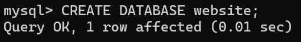

* Create a new table named member, in the website database, designed as below: 
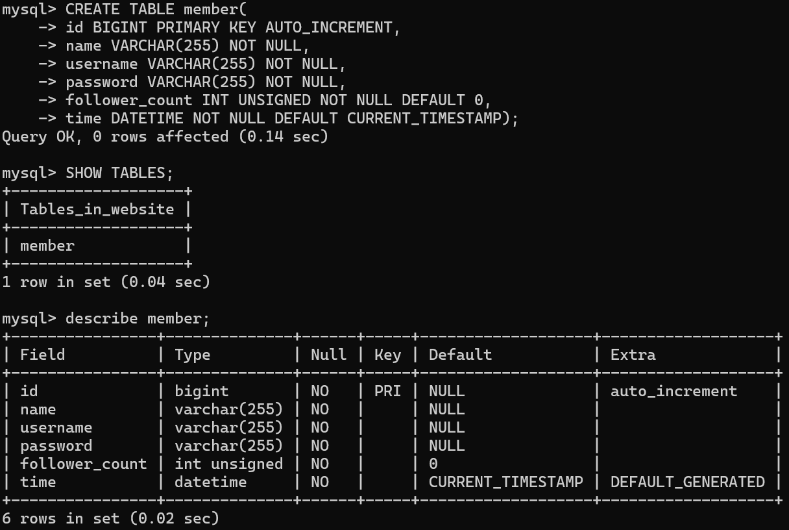

Task 3
---
* INSERT a new row to the member table where name, username be set to test. INSERT additional 4 rows with arbitrary data. 
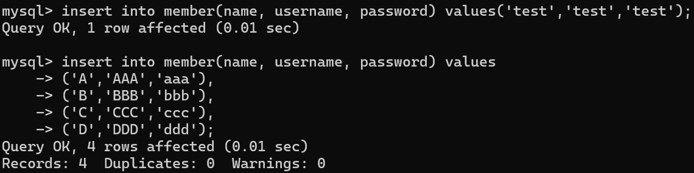

* SELECT all rows from the member table. 
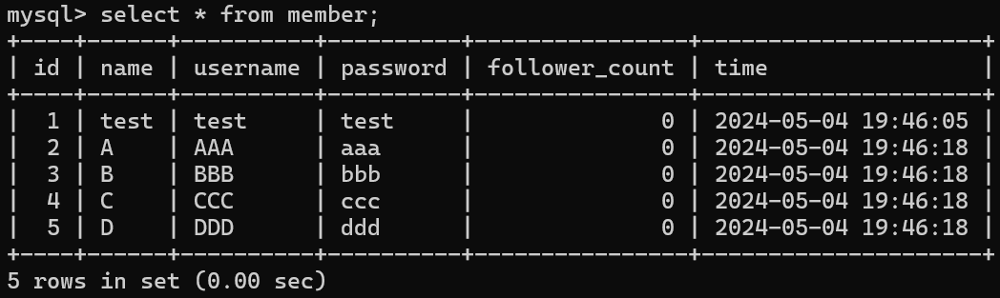

* SELECT all rows from the member table, in descending order of time. 

* SELECT total 3 rows, second to fourth, from the member table, in descending order of time. Note: it does not mean SELECT rows where id are 2, 3, or 4. 
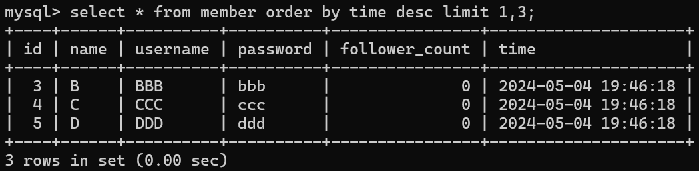

* SELECT rows where username equals to test. 
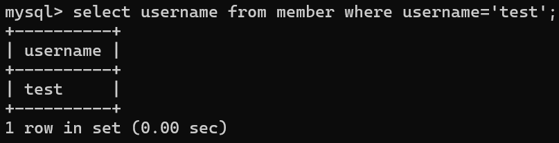

* SELECT rows where name includes the es keyword. 
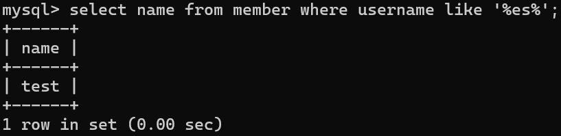

* SELECT rows where both username and password equal to test.
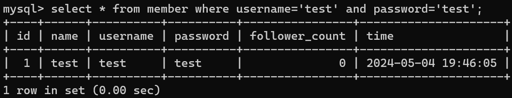

* UPDATE data in name column to test2 where username equals to test.
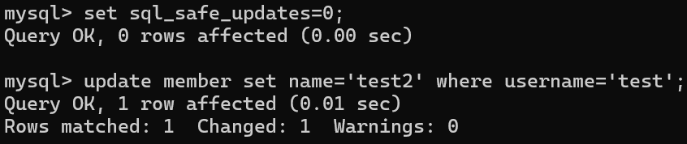

Task 4
---
* SELECT how many rows from the member table.
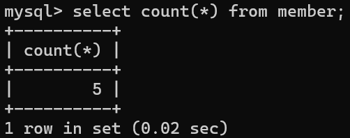
* SELECT the sum of follower_count of all the rows from the member table.
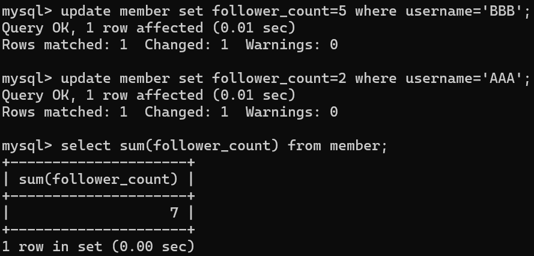
* SELECT the average of follower_count of all the rows from the member table.
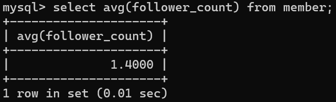
* SELECT the average of follower_count of the first 2 rows, in descending order of follower_count, from the member table.
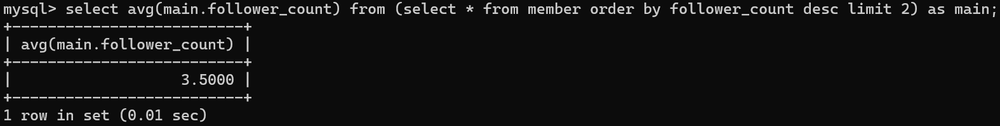

Task 5
---
* Create a new table named message, in the website database. designed as below:
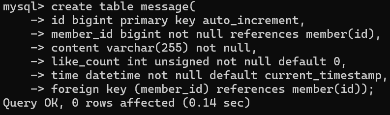

* SELECT all messages, including sender names. We have to JOIN the member table to get that.
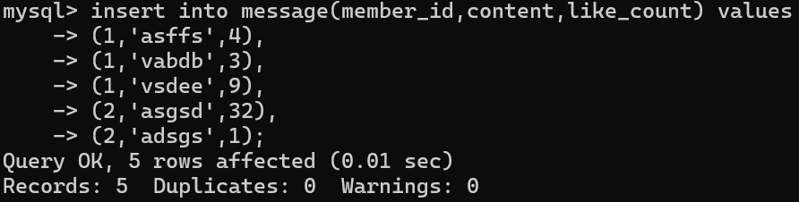
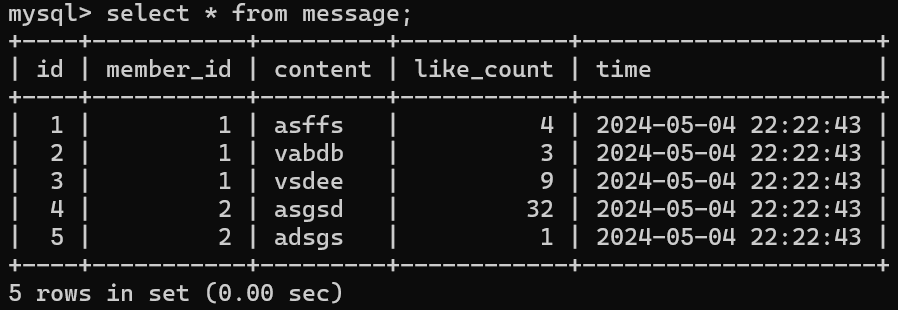

* SELECT all messages, including sender names, where sender username equals to test. We have to JOIN the member table to filter and get that.
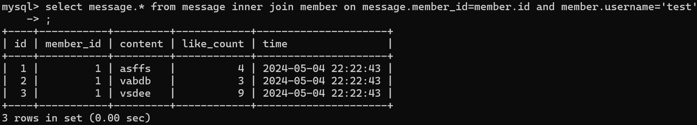

* Use SELECT, SQL Aggregation Functions with JOIN statement, get the average like count of messages where sender username equals to test.
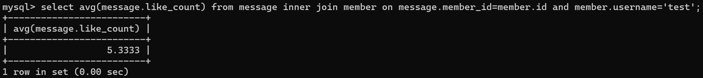

* Use SELECT, SQL Aggregation Functions with JOIN statement, get the average like count of messages GROUP BY sender username.
